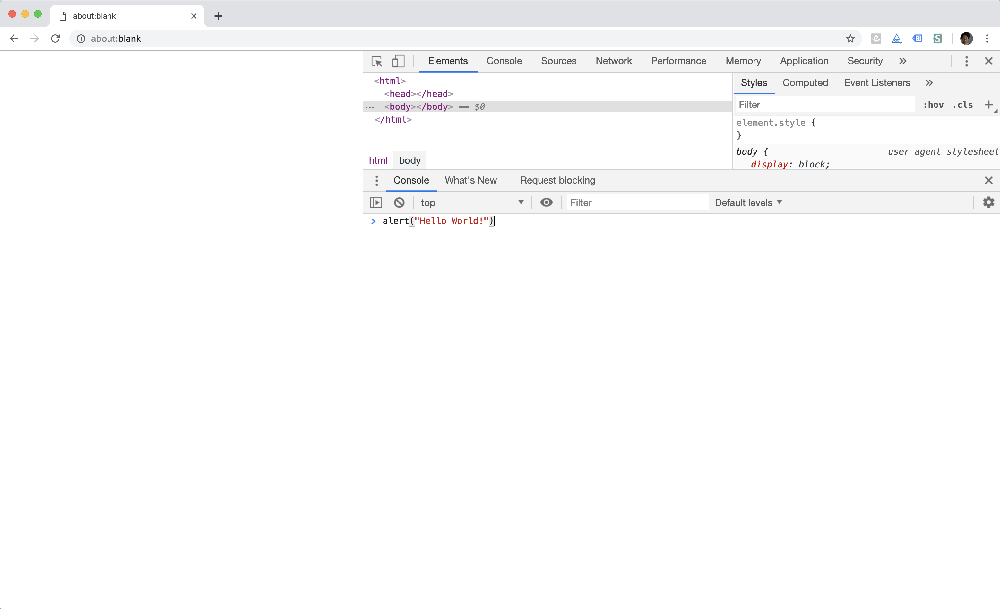

# An Intro to JavaScript

## What is JavaScript?

JavaScript is a dynamic programming language that runs in the browser. This means that your browser (e.g. Chrome, Firefox, Internet Explorer) can not only read JavaScript files,
but is also able to carry them out. A JavaScript file is any text file with a `.js` filename ending and text content which follows the JavaScript language syntax.

In the following section you will learn more about how you can make JavaScript code run in your own browser.

### Running JavaScript directly in your browser

In the following section we will see how we can run JavaScript code directly in our browser. We will not require any text editor as such and we won't need to create any JavaScript files beforehand.
Instead, we will use a **tool** that is pre-installed for us in any browser to write JavaScript and run it subsequently.

#### Exercise: Showing a message box

- Open your browser (Chrome and Firefox are the best options for following this workshop. You can download them here: [Chrome](https://www.google.com/chrome/) [Firefox](https://www.mozilla.org/firefox/))
- Do one of the following:
-- all types of operating systems: right click into the window, select "Inspect" and click on the "Console" tab
-- On Mac: Hit Option + Command + I
-- On Windows: F12 or Control+Shift+I
-- On Linux (e.g. Ubuntu, Fedora): F12 or Control+Shift+I
- Type into the window right next to the small arrow: `alert("Hello World!")`

#### Exercise: Run JavaScript from a file

- Open your text editor
- Open the file `./assets/demo-1b.html` in your text editor (TODO: lol, no one knows how file directories work, right)
- Open the file in your browser (e.g. double-click on it in your file directory or in your editor menu)
- Investigate the `` section
- Fill in a snippet of JavaScript code from the previous exercise into the snippet below the `// comment`
- Reload the page in the browser. What do you see?
- Trouble with the exercise? Open `./assets/demo-1b-solution.html` in your editor and browser

<!-- JavaScript Primer

- What is JavaScript? A language → Demo of console in Chrome dev tools / alert, then html file with JavaScript file with the same code
- Variables. What are they and what do they do? Variable assignment syntax, var / const / let
- console.log + alert. Printing values.
- Exercise: Add an assignment to a call to alert / console.log (Example Page with script tag)
- Exercise: Use var (historic). Use const. Use let. String concatenation example.
- <break here? move to components in Ember app>
- Conditions. What is a condition? How to use if. How to use if / else. Templating if and JS if
- Exercise: Print a statement using if / else.
- Objects. What are objects? What are they used for? How do property assignments work?
- Exercise: Create an object. Update properties of an object and print it.
- Functions? What is this used for and how do you return a value from a function? -->
